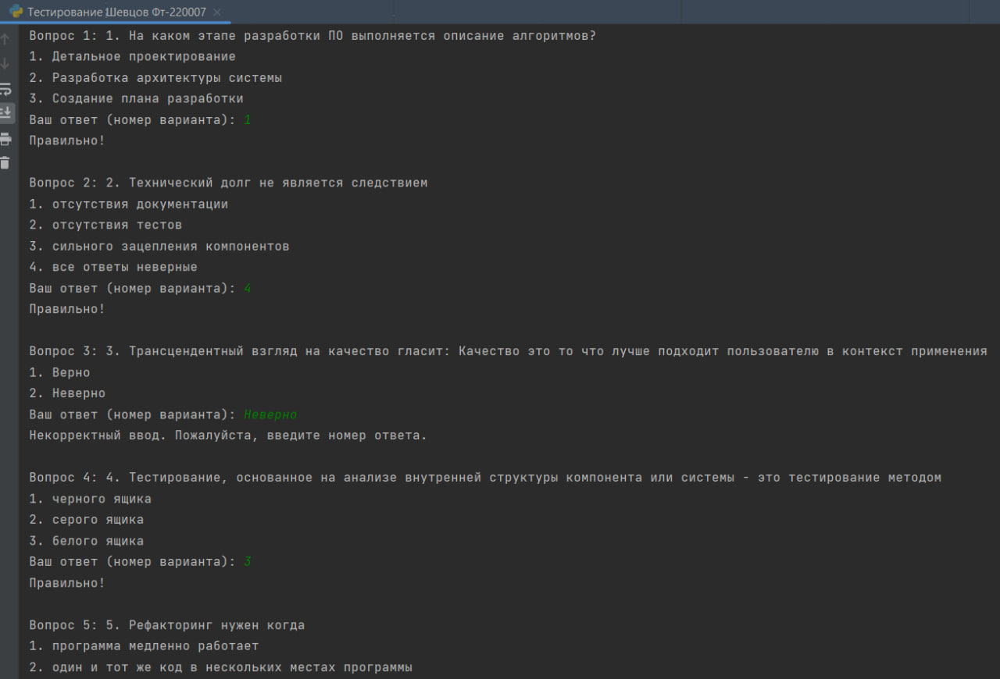
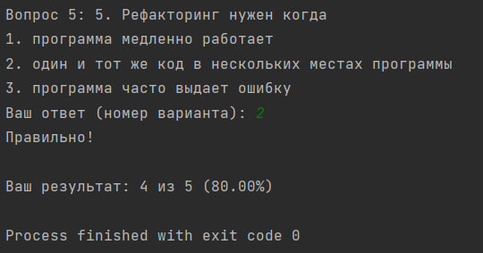
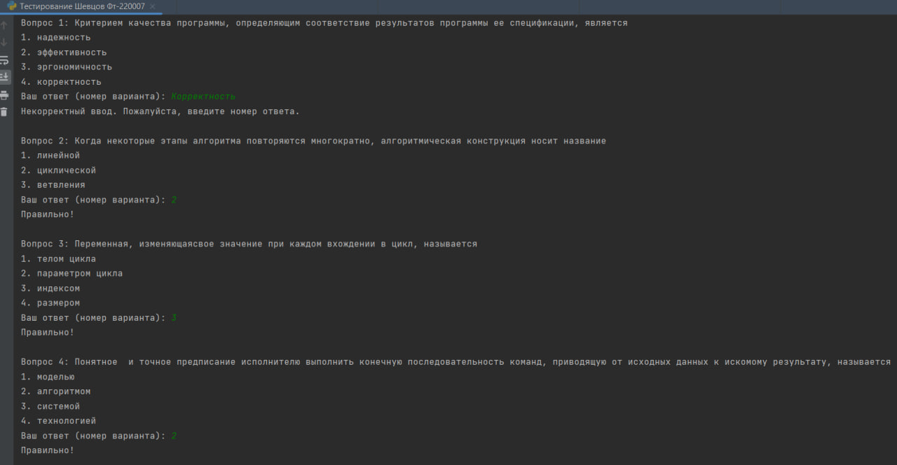
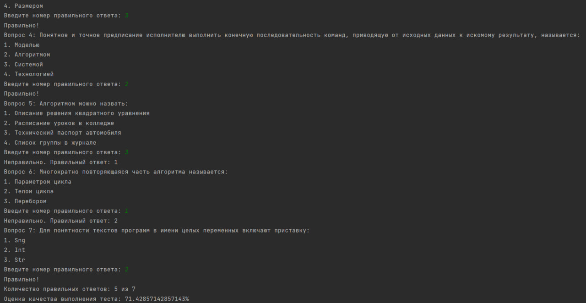

# Исполнитель
Шевцов Михаил
Фт-220007

# Лабораторная работа №13 - Тесты
Пользователь проходит тест 
Программа отражает в Log-файле всю вводимую и выводимую информацию. А также дату, время, тип и результат выполнения операций.

# Среда разработки
Язык программирования Python
Среда разработки PyCharm Edu 2022.2.2

# Инструкция по работе
Чтобы запустить программу, нужно открыть файлы с названием “Тестирование Шевцов Фт-220007.py” в любом компиляторе кода, поддерживающем язык Python, начать тест и следовать указаниям программы.
Убедитесь, что в одной папке с кодом находится файл под названием "test.txt" с вопросами вашего теста.

## Тесты

### Тест 1 с ошибками ввода
___

___

___

### Тест 2, с ошибками ввода. log-файл называется "test_log_test2.log"
___

___

