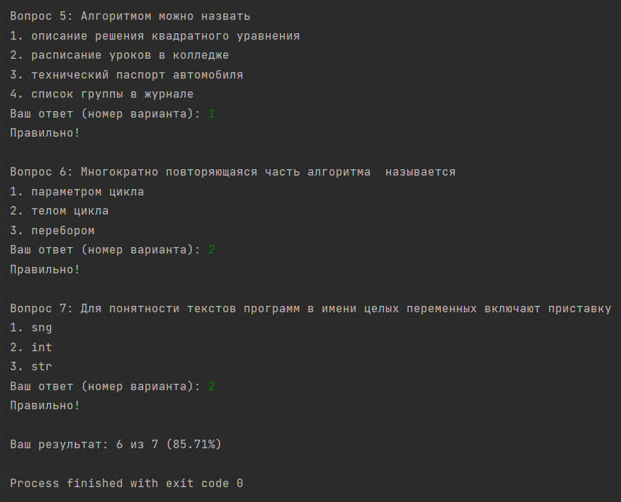

# Исполнитель
Шевцов Михаил
Фт-220007

# Лабораторная работа №13 - Тесты
Пользователь проходит тест 
Программа отражает в Log-файле всю вводимую и выводимую информацию. А также дату, время, тип и результат выполнения операций.

# Среда разработки
Язык программирования Python
Среда разработки PyCharm Edu 2022.2.2

# Инструкция по работе
Чтобы запустить программу, нужно открыть файлы с названием “Тест 1. Шевцов Фт-220007 ВЕРНО.py” и "Тест 2. Шевцов Фт-220007 ВЕРНО.py" в любом компиляторе кода, поддерживающем язык Python, начать тест и следовать указаниям программы.

## Тесты

### Тест 1, с ошибками и без
___

___
___

___

### Тест 2, с ошибками и без
___

___
___

___

